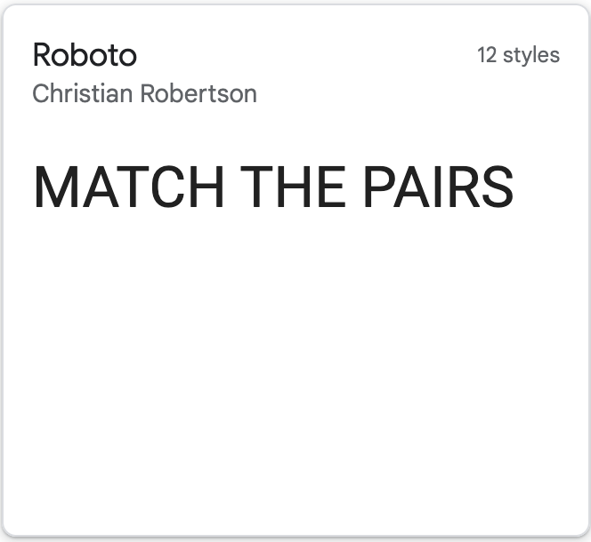
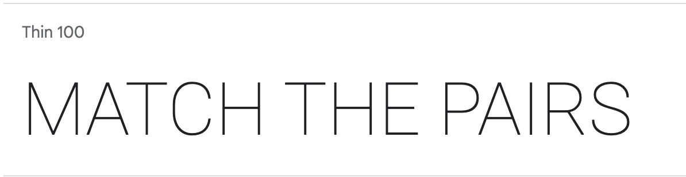
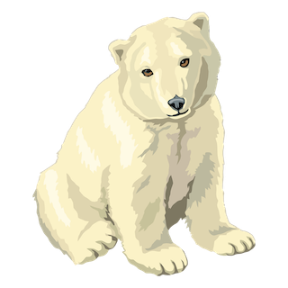
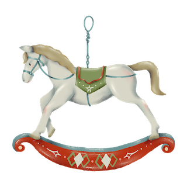
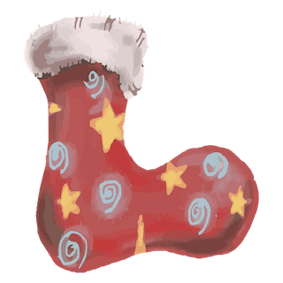

# Christmas Pairs
Christmas themed memory game. Match all pairs in quickest possible time
- [Link to deployed site here]

# User Experience UX
## User Stories
### First Time Visitor Goals
- As a first time visitor I want to be able to view the site on a range of devices
- As a first time visitor I want to be able to easily navigate around the website
- As a first time visitor I want to find their social media profiles 
### Returning Visitor Goals
- As a returning visitor I want 
- As a returning visitor I want 
### Frequent Visitor Goals
- As a frequent user I want 

# Design
The game has a vintage christmas theme enjoyable for young and old

## Colour Scheme
 \
I used [Adobe Color Wheel](https://color.adobe.com/create/color-wheel) to generate a classic, vintage christmas look.

## Typography
- I took inspiration from [Canva](https://www.canva.com/learn/franchise-fonts/) for my font pairing of Limelight and Roboto. Limelight a classic art deco style font and roboto a simple sans serif font.
- Both fonts are found on [Googlefonts](https://fonts.google.com/) I decided to use roboto in thin 100 variable 

 
 

## Imagery
Images for cards and logo were found on [Rawpixel](https://www.rawpixel.com/) and [Vecteezy](https://www.vecteezy.com/) \
 [car_tree](https://www.rawpixel.com/image/4391033/christmas-car-png-sticker-tree-hauling-roof)
 [christmas_tree](https://www.rawpixel.com/image/6707658/png-xmas-sticker)
 [holly](https://www.rawpixel.com/image/6673966/png-plant-christmas)
  [pinecone](https://www.rawpixel.com/image/2354874/free-illustration-png-christmas-pine-cone-winter)
 [polar_bear](https://www.rawpixel.com/image/6284543/png-sticker-public-domain) \
 [ponsietta](https://www.vecteezy.com/png/13219432-christmas-element-decoration-hand-drawn-doodle-christmas-clip-art)
 [present](https://www.rawpixel.com/image/6643652/png-christmas-sticker)
 [robin](https://www.rawpixel.com/image/6684930/png-sticker-vintage)
 [rocking_horse](https://www.rawpixel.com/image/3988696/illustration-png-sticker-xmas)
 [stocking](https://www.rawpixel.com/image/1231010/red-christmas-stocking)
 [snowflake](https://www.rawpixel.com/image/6600470/png-aesthetic-christmas)

## Wireframes
 

# Features
## Current Features
### Header
Name of game
### Christmas Countdown Timer
Christmas countdown timer counting down days to christmas
### How to Play Section
Brief instruction of how to play
### Game container
Grid of 20 cards
### Level and Timer 
### The footer
- The footer holds links to social media 
- When the user clicks on social media links they will open in a new tab
## Features Left to Implement

# Testing
## Validator Testing
### HTML
### CSS
### JavaScript
### Lighthouse Testing
## BUGS
## Unfixed Bugs

# Deployment
The site was deployed to GitHub pages.\
The steps to deploy are as follows:
- In the GitHub repository, navigate to the Settings tab
- Select pages from the left column

# Technologies Used
## Languages Used
- HTML
- CSS
- JavaScript
## Frameworks, Libraries & Progrmas Used
- Google Fonts -
- Dev Tools - were used to check how project looked on different screen sizes and also to troubleshoot errors and try out changes
- Unsplash - stock image site used for images on the website
- Mac Preview - used to resize large images
- Adobe Color Wheel - used to extract  color theme from main image
- Balsamiq

# Credits

## Content

## Media
-All images taken from...
