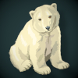
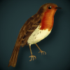
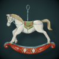
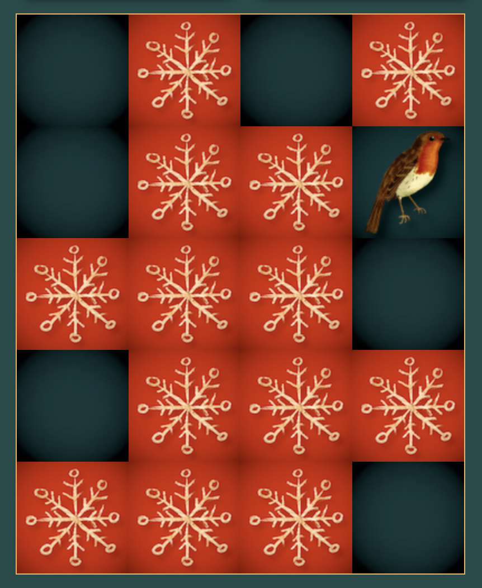

# Christmas Pairs
Christmas Pairs is a christmas themed memory card game \
[Link to deployed site at github pages here](https://kerrie-jones.github.io/christmas-pairs/)
 

# User Experience UX
## User Stories
### First Time Visitor Goals
- As a first time visitor I want to be able to play the game on a range of devices
- As a first time visitor I want a fun game that challenges my memory and learning
- As a first timer visitor I want to see how many days are left to christmas
- As a first time visitor I want to find their social media profiles 
### Returning Visitor Goals
- As a returning visitor I want to beat my previous score
- As a returning visitor I want to improve my memory and learning skills
 
# Design
- The game has a vintage christmas theme enjoyable for young and old
- It is a single page design
- Mobile first design was implemented in the planning stages

## Colour Scheme
 \
I used [Adobe Color Wheel](https://color.adobe.com/create/color-wheel) to generate a classic, vintage christmas look.

## Typography
- Limelight is a classic art deco style font 
- Josefin sans is an elegant, vintage sans serif font
- Both fonts are found on [Googlefonts](https://fonts.google.com/)

 

## Imagery
- The favicon for the page was generated in [favicon.io](https://favicon.io/) using the christmas tree image also used as one of my cards\

- Images for cards and logo were found on [Rawpixel](https://www.rawpixel.com/) and [Vecteezy](https://www.vecteezy.com/) \
[car_tree](https://www.rawpixel.com/image/4391033/christmas-car-png-sticker-tree-hauling-roof) &nbsp; &nbsp; &nbsp; &nbsp; &nbsp; 
 [christmas_tree](https://www.rawpixel.com/image/6707658/png-xmas-sticker) &nbsp; 
 [holly](https://www.rawpixel.com/image/6673966/png-plant-christmas) &nbsp; &nbsp; &nbsp;
  [pinecone](https://www.rawpixel.com/image/2354874/free-illustration-png-christmas-pine-cone-winter) \
 [polar_bear](https://www.rawpixel.com/image/6284543/png-sticker-public-domain) &nbsp; &nbsp; &nbsp;
 [ponsietta](https://www.vecteezy.com/png/13219432-christmas-element-decoration-hand-drawn-doodle-christmas-clip-art) &nbsp; &nbsp; &nbsp; &nbsp; &nbsp;
 [present](https://www.rawpixel.com/image/6643652/png-christmas-sticker) &nbsp; 
 [robin](https://www.rawpixel.com/image/6684930/png-sticker-vintage) \
 [rocking_horse](https://www.rawpixel.com/image/3988696/illustration-png-sticker-xmas)
 [stocking](https://www.rawpixel.com/image/1231010/red-christmas-stocking) &nbsp; &nbsp; &nbsp; &nbsp; &nbsp; &nbsp;
 [snowflake](https://www.rawpixel.com/image/6600470/png-aesthetic-christmas)

## Wireframes
- I created a wireframe on balsamiq starting with mobile design first \
 

# Features
## Current Features
### Header
- Name of game \

### Christmas Countdown Timer
- Christmas countdown timer counting down days to christmas. Snowlike effect added in css. \

### Instructions Button 
- This button when clicked brings up the instructions popup. \
 

### Instructions Popup 
- Modal popup with instruction on how to play. User can close out of this by clicking x or anywhere outside the box \

### Replay Button
- This button when clicked refreshes the page, so the user can restart the game \

### Game Grid
- Grid of 20 cards. 10 matching pairs. All cards initially will have the red snowflake image. 2 cards are then flipped revealing card image. If pairs are a match there will then be a plain green image in place of the red snowflake image. If not a match they will revert back to the red snowflake image ready for user to flip two more cards \

### Pairs Won Counter Display and Flips Counter Display
- Displays the number of pairs matched and number of cards flipped incrementally increasing as the user plays game \

### Win Game Popop
- When all pairs are matched there is a modal popup telling the user they have won the game in however many flips and to press replay to play again. \

### The footer
- The footer holds links to social media 
- When the user clicks on social media links they will open in a new tab \

## Features Left to Implement
- I would like to implement a scoreboard where the user can keep track of their previous scores

# Testing
- I have tested the website on various different screen sizes in dev tools.
- I have tested the website on chrome, safari and firefox.
- I have used dev tools during project build to help with troubleshooting and to verify that code was working.
## Validator Testing
### HTML W3C Validator
- index.html No errors returned when passing through the official [W3C Validator](https://validator.w3.org/)
### CSS Jigsaw Validator
- style.css No errors returned when passing through the official [Jigsaw Validator](https://jigsaw.w3.org/css-validator/)
### JavaScript JS Hint Validator
- script.js No errors returned when passing through the official [JS Hint](https://jshint.com/)
### Lighthouse Testing
- Lighthouse testing initialy showed lower accessibility as I did not have alt attributes on the images in javascript. I added theses and score improved for both mobile and desktop seen below \

## BUGS
### Solved Bugs
- It was possible to flip a third card before check for match function started so I added an if statement to the start of my flipcard function if < 2 cards are picked they are pushed into the empty array and if ===2 check for match function begins, else flip back to snowflake img.
### Unfixed Bugs
- When popup modals are open the main body still scrolls. Given more time I would like to rectify this.

# Deployment
The site was deployed to GitHub pages.\
The steps to deploy are as follows:
- In the GitHub repository, navigate to the Settings tab
- Select pages from the navigation bar to the left
- Select main branch and save
- Site now deployed but may take a few minutes

# Technologies Used
## Languages Used
- HTML
- CSS
- JavaScript
## Frameworks, Libraries & Programs Used
- [Am I Responsive?](https://ui.dev/amiresponsive) - shows website is responsive on a range of devices 
- [Google Fonts](https://fonts.google.com/) - fonts used from google fonts
- [Font Awesome](https://fontawesome.com/) - used icons for header and pairs & flips counter
- [Favicon.io](https://favicon.io/) - used to generate the favicon 
- [Rawpixel](https://www.rawpixel.com/) - stock image site used for images on the website
- [Vecteezy](https://www.vecteezy.com/) - stock image site used for images on the website
- [Adobe Color Wheel](https://color.adobe.com/create/color-wheel/) - used to extract  color theme from main image
- Mac Preview - used to resize large images
- Dev Tools - were used to check how project looked on different screen sizes and also to troubleshoot errors and try out changes
- Balsamiq - wireframe
- GIMP - editing images background
- GIT - used for version control
- GITHub - code pushed from GIT and stored in GITHub
- GITPod - workspace used in gitpod to work on project then push to github

# Credits
## Online Tutorials
- Initial code for memory game inspired by https://www.youtube.com/watch?v=tjyDOHzKN0w Make MEMORY GAME in JavaScript, HTML and CSS for your portfolio 
- Code for modal boxes inspired by: https://www.w3schools.com/howto/howto_css_modals.asp  How TO - CSS/JS Modal 
- Code for snow effect on countdown timer from: https://codepen.io/Calleb/pen/dyVRvyW
- Countdown Timer code inspired by https://www.youtube.com/watch?v=V-Mcul5kS_Y Build a Birthday Countdown in JavaScript (super simple!) and https://www.w3schools.com/howto/tryit.asp?filename=tryhow_js_countdown How TO - JavaScript Countdown Timer

## Content
- Content was written by Kerrie Jones

## Media
- Images are taken [from Rawpixel](https://www.rawpixel.com/) and [Vecteezy](https://www.vecteezy.com/) image links in imagery section above.
- Icons are from [font-awesome](https://fontawesome.com/) 
- Favicon generated in [Favicon.io](https://favicon.io/)
