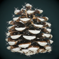

# Christmas Pairs
- Christmas themed memory game. Match all pairs in least amount of flips
- [Link to deployed site here]

# User Experience UX
## User Stories
### First Time Visitor Goals
- As a first time visitor I want to be able to view the site on a range of devices
- As a first time visitor I want a fun game that challenges my memory and learning
- As a first time visitor I want to find their social media profiles 
### Returning Visitor Goals
- As a returning visitor I want to beat my previous score
- As a returning visitor I want to improve my memory and learning skills
### Frequent Visitor Goals
- As a frequent user I want 

# Design
- The game has a vintage christmas theme enjoyable for young and old
- It is a single page design
- Mobile first design was implemented in the plannig stages

## Colour Scheme
 \
I used [Adobe Color Wheel](https://color.adobe.com/create/color-wheel) to generate a classic, vintage christmas look.

## Typography
- Limelight is a classic art deco style font 
- Josefin sans is an elegant, vintage sans serif font
- Both fonts are found on [Googlefonts](https://fonts.google.com/) I decided to use roboto in thin 100 variable 

 

## Imagery
- The favicon for the page was generated in favicon.co

- Images for cards and logo were found on [Rawpixel](https://www.rawpixel.com/) and [Vecteezy](https://www.vecteezy.com/) \
[car_tree](https://www.rawpixel.com/image/4391033/christmas-car-png-sticker-tree-hauling-roof) &nbsp; &nbsp; &nbsp; &nbsp; &nbsp; 
 [christmas_tree](https://www.rawpixel.com/image/6707658/png-xmas-sticker) &nbsp; 
 [holly](https://www.rawpixel.com/image/6673966/png-plant-christmas) &nbsp; &nbsp; &nbsp;
  [pinecone](https://www.rawpixel.com/image/2354874/free-illustration-png-christmas-pine-cone-winter) \
 [polar_bear](https://www.rawpixel.com/image/6284543/png-sticker-public-domain) &nbsp; &nbsp; &nbsp;
 [ponsietta](https://www.vecteezy.com/png/13219432-christmas-element-decoration-hand-drawn-doodle-christmas-clip-art) &nbsp; &nbsp; &nbsp; &nbsp; &nbsp;
 [present](https://www.rawpixel.com/image/6643652/png-christmas-sticker) &nbsp; 
 [robin](https://www.rawpixel.com/image/6684930/png-sticker-vintage) \
 [rocking_horse](https://www.rawpixel.com/image/3988696/illustration-png-sticker-xmas)
 [stocking](https://www.rawpixel.com/image/1231010/red-christmas-stocking) &nbsp; &nbsp; &nbsp; &nbsp; &nbsp; &nbsp;
 [snowflake](https://www.rawpixel.com/image/6600470/png-aesthetic-christmas)

## Wireframes
- I created a wireframe on balsamiq starting with mobile design first \
 

# Features
## Current Features
### Header
- Name of game
### Christmas Countdown Timer
- Christmas countdown timer counting down days to christmas
### Instructions Button
### Instructions Popup
- Brief instruction of how to play
### Replay Button
### Game container
- Grid of 20 cards
### Pairs Won Counter Display and Flips Counter Display
- Displays the number of pairs matched and number of cards flipped as user plays game
### The footer
- The footer holds links to social media 
- When the user clicks on social media links they will open in a new tab

## Features Left to Implement

# Testing
## Validator Testing
### HTML
### CSS
### JavaScript
### Lighthouse Testing
## BUGS
## Unfixed Bugs

# Deployment
The site was deployed to GitHub pages.\
The steps to deploy are as follows:
- In the GitHub repository, navigate to the Settings tab
- Select pages from the left column
- Select main branch and save
- Site now deployed but may take a few minutes

# Technologies Used
## Languages Used
- HTML
- CSS
- JavaScript
## Frameworks, Libraries & Progrmas Used
- Google Fonts -
- Dev Tools - were used to check how project looked on different screen sizes and also to troubleshoot errors and try out changes
- Font Awesome - Icons for the benefits of hiking section, top hikes section and footer were used from this site
- Favicon.io - used to generate the favicon
- Rawpixel - stock image site used for images on the website
- Vecteezy - stock image site used for images on the website
- Mac Preview - used to resize large images
- Adobe Color Wheel - used to extract  color theme from main image
- Balsamiq - wireframe
- GIMP - editing images background
- GIT - used for version control
- GITHub - code pushed from GIT and stored in GITHub
- GITPod - workspace used in gitpod to work on project then push to github

# Credits
## Online Tutorials
- https://www.youtube.com/watch?v=tjyDOHzKN0w Make MEMORY GAME in JavaScript, HTML and CSS for your portfolio by Ania Kubow
-https://www.w3schools.com/howto/howto_css_modals.asp  How TO - CSS/JS Modal

## Content
- Content was written by Kerrie Jones

## Media
- Images are taken [from Rawpixel](https://www.rawpixel.com/) and [Vexteezy](https://www.vecteezy.com/)
- Icons are from [font-awesome](https://fontawesome.com/)
- Favicon generated
